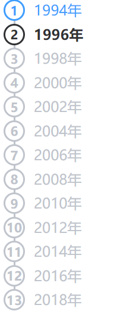
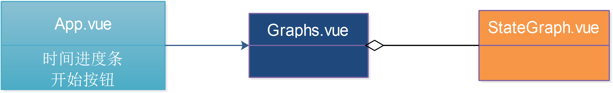

# Vue-eharts地图渐热效果实现

基于Element-ui， Vue和Vue-echarts的地图渐热效果实现。

展示的内容是从1994年至2018年大陆金融业和房地产行业的发展情况（当地的相关企业越多则热度越大），数据全部是从猎聘网上爬取的。

- 金融行业企业数据：[https://github.com/DQinYuan/mapvisual/blob/master/src/assets/finance.json](https://github.com/DQinYuan/mapvisual/blob/master/src/assets/finance.json) (即项目目录的/src/assets/finance.json)
- 房地产行业企业数据：[https://github.com/DQinYuan/mapvisual/blob/master/src/assets/estate.json](https://github.com/DQinYuan/mapvisual/blob/master/src/assets/estate.json) (即项目目录的/src/assets/estate.json)

数据都是按照时间从远到近有序放置的，只有这样程序才能正确地工作。

效果展示地址：https://dqinyuan.github.io/mapvisual/index.html

将项目clone下来，直接用浏览器打开/docs/index.html，也可以看到同样的效果。

打开页面后点击左上角如下样式的圆形按钮后地图就会开始随着时间进度条渐热：

​         


## Build Setup

``` bash
# install dependencies
npm install

# serve with hot reload at localhost:8080
npm run dev

# build for production with minification
npm run build
# 用浏览器直接打开生成的/dist/index.html即可看到效果
```

大陆的朋友建议用cnpm代替npm


# 一些可以修改的配置

在/src/config.js中有一些可以修改的配置，主要是和时间进度条相关的配置：

```
let config = {
    start:1994,     //进度条从1994年开始
    end:2018,       //进度条到2018年结束
    interval:2,     //进度条每隔2年推进一次
    time:150        //图像每150毫秒刷新一次
}
export default config;
```

按照这样配置出来的时间进度条会像这样：




注意，这个配置不仅会影响进度条的展示，程序的逻辑也会自动适应配置。我给的数据中的企业最早是1980年创立的，最晚是在2018年，如果像上面那样配置时间段为1994-2018年的话，则1980年-1994年之间创立的企业所在的地点在按钮刚点下去的时候就会是“热”的。


有关地图的样式的echarts配置在/src/components/StateGraph.vue文件中，可以参照[echarts文档](http://echarts.baidu.com/option.html)自行修改。


# 其他实现细节

最关键的三个组件是/src/App.vue，/src/Graphs.vue，/src/components/StateGraph.vue。其中StateGraph.vue组件就代表着一张echarts地图，他们包含关系如下：





时间进度条和开始按钮等小的组件就直接放在App.vue中了，然后它包含一个Graphts.vue的组件，顾名思义，Graphs.vue就是用来放地图的，它里面包含两个StateGraph.vue组件，分别用来展示房地产行业的渐热效果与金融业的渐热效果。


代码利用Vue的数据与模块绑定的特点，直接通过往vue-echarts组件的数据数组里添加元素来实现视图的更新。

我们来追踪一下点击开始按钮之后的流程你大概就知道程序时怎么运作的了。

- 当你点击下开始按钮的时候，App.vue的第43行处的代码会被执行：

```
    refreshMap(){
      //console.log("开始refresh");
      this.activeStep = 1;
      bus.$emit("refresh_map");
    }
```

​      可以看到，它把进度条置于开始位置后，像总线发射了一个"refresh_map"事件。

- Graphs.vue的第96行的如下代码监听了总线上的"refresh_map"事件:

```
    bus.$on("refresh_map", function() {
      clearInterval(that.timerId);
      for (let i = 0; i < that.cursors.length; i++) {
        that.cursors[i] = 0;
      }
      that.financedatas.splice(0, that.financedatas.length);
      that.estatedatas.splice(0, that.estatedatas.length);

      that.start_date = new Date(config.start, 0, 1, 0, 0, 0, 0);
      that.timerId = setInterval(that.job, config.time);
    });
```

这里的financedatas和estatedatas就是分别绑定金融业地图和房地产业地图视图的数组，往这两个数组里放置或者删除数据会导致地图视图的热力发生改变。这里直接使用splice方法将两个数组清空，这样地图就重新变成空的地图了，在setInterval之前的代码都是一些简单的清空操作，setInterval设置了一个定时器每隔config.time的时间执行一次job，job的内容其实就是往financedatas和estatedatas添加一些数据而已，下面具体看一看。

- Graphs.vue的第68行代码就是job的具体内容:

  ```
      this.job = function() {
        update(finances, that.financedatas, 0, that.start_date, 10);
        update(estates, that.estatedatas, 1, that.start_date, 10);
  
        //更新时间与修改进度条
        let previousYear = that.start_date.getFullYear();
        that.start_date = utils.upgradeDateByQuarter(that.start_date);
        //console.log(previousYear);
        //console.log(that.start_date.getFullYear());
        //console.log("--------------------------------");
        // console.log(that.start_date.getMonth());
        if (previousYear != that.start_date.getFullYear()) {
          inter_flag += 1;
          if (inter_flag % config.interval == 0) {
            bus.$emit("step");
          }
          if (previousYear == config.end - 1) {
            //console.log("时间到++++++++++++++++++++++++++++=");
            clearInterval(that.timerId);
          }
        }
      };
  ```

  代码`that.start_date = utils.upgradeDateByQuarter(that.start_date);`会以季度（Quarter）为单位更新时间，如果`if (previousYear != that.start_date.getFullYear())`发现年份出现变化，则可能需要更新进度条，通过`if (inter_flag % config.interval == 0)`发现需要更新进度条之后，则向总线发送"step"事件，App.vue中监听了这个时间，就会把进度条往前推一格，这个方法的重点是最前面两行的update方法调用，update的内容其实大概就是把finances和estates（这两个代表的是全量数据）中时间点要小于`that.start_date`的数据加入financedatas和estatedatas，以促使视图更新。

- update方法的内容位于Graphs.vue的第50行：

  ```
      /**
       * fields:与echarts视图绑定的数组
       * field_datas:完整的数据数组
       * cursor_index:该地图的游标在游标数组(cursors)中的位置
       * com_date:当前时间
       * factor:期望更新的点在地图中占的比重，比重越大，则越热
       */
      function update(fields, field_datas, cursor_index, com_date, factor) {
        for (
          ;
          that.cursors[cursor_index] < fields.length;
          that.cursors[cursor_index]++
        ) {
          let field = fields[that.cursors[cursor_index]];
          // console.log(utils.date2string(this.start_date));
          // console.log(finance.datestr);
          if (utils.string2date(field.datestr).valueOf() <= com_date.valueOf()) {
            field_datas.push([field.lon, field.lat, factor]);
          } else {
            break;
          }
        }
      }
  ```

  就是一个for循环，`if (utils.string2date(field.datestr).valueOf() <= com_date.valueOf())`发现全量数据(field_datas)中有小于当前时间点的，就通过push方法将其加入与视图绑定的数组中，促使视图更新。


# END